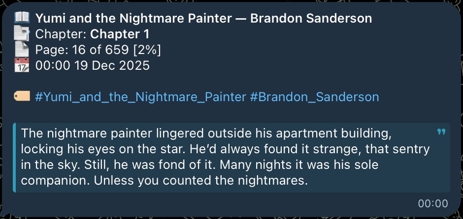
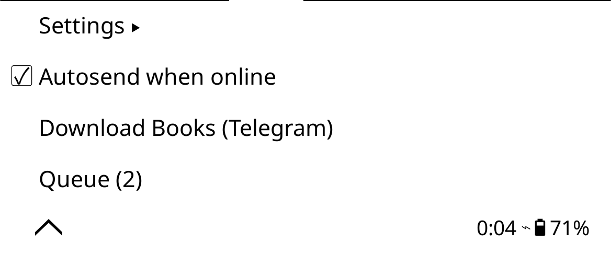
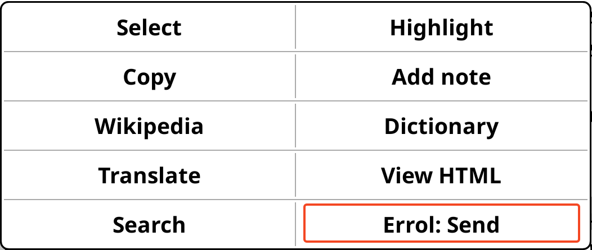
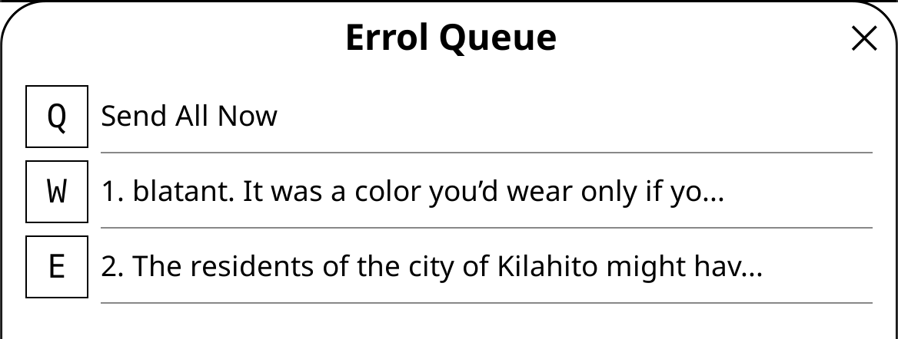
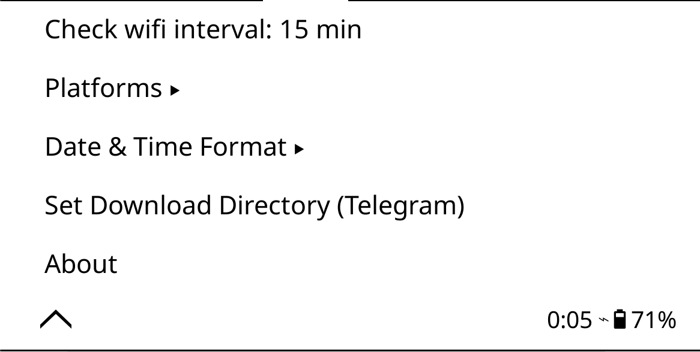
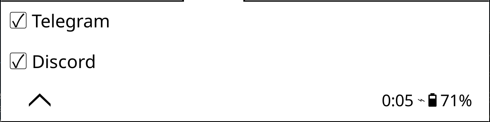

# Errol - Highlight Sender for KOReader

**Errol** is a plugin for [KOReader](https://github.com/koreader/koreader) that instantly sends your book highlights (quotes) to **Telegram** and **Discord**.

Designed for seamless reading, it supports **offline queuing**, automatic background syncing, and granular control over where your highlights go.



<details>
<summary><b>More Screenshots (Menus, Queue, Settings)</b></summary>

| **Main Menu** | **Context Menu** |
| :---: | :---: |
|  |  |

| **Queue Manager** | **Settings** |
| :---: | :---: |
|  |  |

| **Platforms** | **Discord Example** |
| :---: | :---: |
|  |  |

| **Date & Time Config** | **Cache Status** |
| :---: | :---: |
|  |  |

</details>

## Features

*   **Multi-Platform Support:** Send highlights to a Telegram Bot, a Discord Channel (via Webhook), or both.
*   **Offline First:** Reading on the subway or in flight mode? Errol queues your highlights and automatically sends them when you're back online.
*   **Rich Metadata:** Includes book title, chapter, page number, and reading progress with every quote.
*   **Book Downloader:** (Telegram Only) Send book files to your bot, and download them directly to your device via the Errol menu.
*   **Customizable:**
    *   Toggle platforms individually (Telegram/Discord).
    *   Choose your preferred date & time format.
    *   Set custom Wi-Fi check intervals for autosend.
*   **Queue Manager:** View, manage, and manually flush your pending highlights queue directly from the device.

## Installation

1.  Download the latest release ZIP file from the [Releases page](../../releases).
2.  Unzip the archive and copy the `errol.koplugin` folder to your KOReader plugins directory:
    *   **Android:** `/sdcard/koreader/plugins/`
    *   **Kindle/Kobo:** `/mnt/onboard/.adds/koreader/plugins/` (connection via USB required)

## Configuration

1.  Open the `errol.koplugin` folder.
2.  Rename `config.example.lua` to `config.lua`.
3.  Open `config.lua` and fill in your details:

```lua
return {
    telegram = {
        -- How to create a bot: https://core.telegram.org/bots/tutorial#obtain-your-bot-token
        token = "123:ABC", 
        chat_id = "11111" 
    },
    discord = {
        -- How to create a webhook: https://support.discord.com/hc/en-us/articles/228383668-Intro-to-Webhooks
        webhook_url = "https://discord.com/api/webhooks/123/ABC"
    }
}
```

## Setup Guide

### Telegram
1.  **Create a Bot:**
    *   Open Telegram and search for **[@BotFather](https://t.me/BotFather)**.
    *   Send the command `/newbot`.
    *   Follow the instructions to name your bot.
    *   **Result:** You will get an **API Token** (e.g., `123456:ABC-DEF...`). Copy this to `config.lua` as `token`.
2.  **Get Chat ID:**
    *   Search for **[@userinfobot](https://t.me/userinfobot)** (or any similar ID bot).
    *   Start the bot. It will reply with your `Id`.
    *   **Result:** Copy this number (e.g., `123456789`) to `config.lua` as `chat_id`.
    *   **Important:** Start a chat with *your new bot* (click Start) so it can send you messages!

### Discord
1.  **Create a Webhook:**
    *   Go to your Discord Server settings.
    *   Navigate to **Integrations** -> **Webhooks**.
    *   Click **New Webhook**.
    *   Choose the channel where you want highlights to appear.
    *   **Result:** Click **Copy Webhook URL**. Paste this into `config.lua` as `webhook_url`.

## Usage

### 1. Highlighting
Simply highlight text in any book.
*   If **Online**: It sends immediately.
*   If **Offline**: It saves to the queue.
*   You can also select "Errol" from the highlight context menu if you don't want to use auto-send logic.

### 2. Menu
Go to **Tools (Wrench icon) -> Errol**:

*   **Settings:**
    *   **Check wifi interval:** How often to check connection for autosend (default 15m).
    *   **Platforms:** Toggle Telegram / Discord on or off.
    *   **Date & Time Format:** Customize the timestamp format.
    *   **Set Download Directory:** Choose where Telegram books are saved.
    *   **About:** Check plugin version and updates.
*   **Autosend when online:** Toggle background syncing.
*   **Download Books (Telegram):** Fetch documents sent to your bot.
*   **Queue:** View count of pending items. Tap to open **Queue Manager** (delete or send items).
